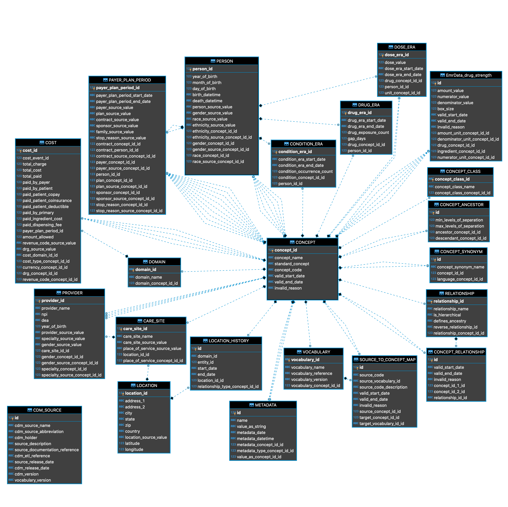

# Django-OMOP

The OMOP Common Data Model (v6) implemented in Django3.1. For more information regarding OMOP, please visit OHDSI CDM Working Group (https://ohdsi.github.io/CommonDataModel/index.html).

##### Django-OMOP data entity relations diagram



## How-to

### Set up Django

##### Clone repo and navigate to root directory of the repo.

`git clone https://github.com/airoscar/Django-OMOP`

##### Create environment from the environment.yml file using Conda:

`conda env create -f environment.yml`

##### Activate environment:

`conda activate omop`

##### Create a 'secrets' folder for storing environment variable (this folder is in gitignore):

`mkdir secrets`

##### Create a file for environment variables (Mac/Linux):

`nano secrets/env_vars.command`

##### In the file write the following (Mac/Linux):

```
export DJANGO_SECRET_KEY="RANDOM_STRING_FOR_DJANGO_HASHING"
export DJANGO_DEBUG=True
```

The DJANGO_SECRET_KEY should be a long string of random characters. Save and close the file.

##### Load environment variables from the file you just created (Mac/Linux):

`source ./secrets/env_vars.command`

##### Set up database:

`python manage.py migrate`
And you should see the database being created, by default this would be a `db.sqlite3` file located in the root directory.

### Initialize database

##### Register and download Athena vocabularies:

`https://athena.ohdsi.org/vocabulary/list`

##### Make a `OMOP_assets` folder in the `secrets` folder, and copy the following vocabulary csv files into location:

```
Django-OMOP/secrets/OMOP_assets/CONCEPT_ANCESTOR.csv
Django-OMOP/secrets/OMOP_assets/CONCEPT_CLASS.csv
Django-OMOP/secrets/OMOP_assets/CONCEPT_CPT4.csv
Django-OMOP/secrets/OMOP_assets/CONCEPT_RELATIONSHIP.csv
Django-OMOP/secrets/OMOP_assets/CONCEPT_SYNONYM.csv
Django-OMOP/secrets/OMOP_assets/CONCEPT.csv
Django-OMOP/secrets/OMOP_assets/DOMAIN.csv
Django-OMOP/secrets/OMOP_assets/DRUG_STRENGTH.csv
Django-OMOP/secrets/OMOP_assets/RELATIONSHIP.csv
Django-OMOP/secrets/OMOP_assets/VOCABULARY.csv
```

##### Run initialization:

Use Django's ORM to initialize vocabulary tables:

```
python manage.py initialize
```

This will launch a set of management commands to read the csv files into database. This process relies on SQL queries to populate the data tables, and may take **several hours** to complete; however it works with all database engines supported by Django.

Alternatively, you can use the database shell's built-in tools to load data into data tables much faster. This process will be database-dependent:

- PostgreSQL: [COPY](https://www.postgresql.org/docs/13/sql-copy.html)
- MySQL: [LOAD DATA INFILE](https://dev.mysql.com/doc/refman/8.0/en/load-data.html)
- SQLite: [.import FILE TABLE](https://sqlite.org/cli.html)

Please note that some of these database-specific commands may load csv columns as is, therefore you will need to make sure the data tables have the same column order as the csv file, first row (column header) is skipped, etc.
